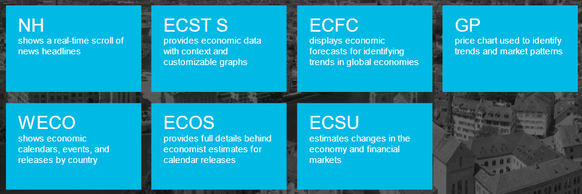
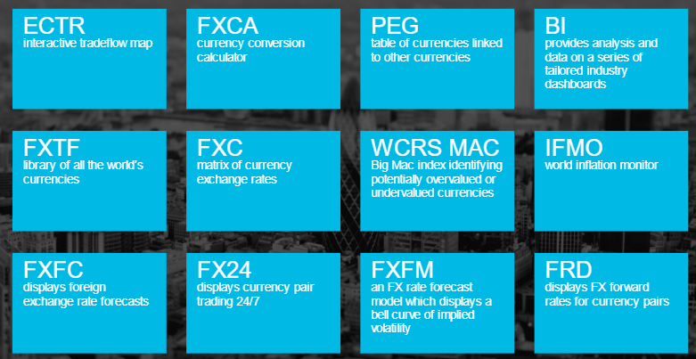
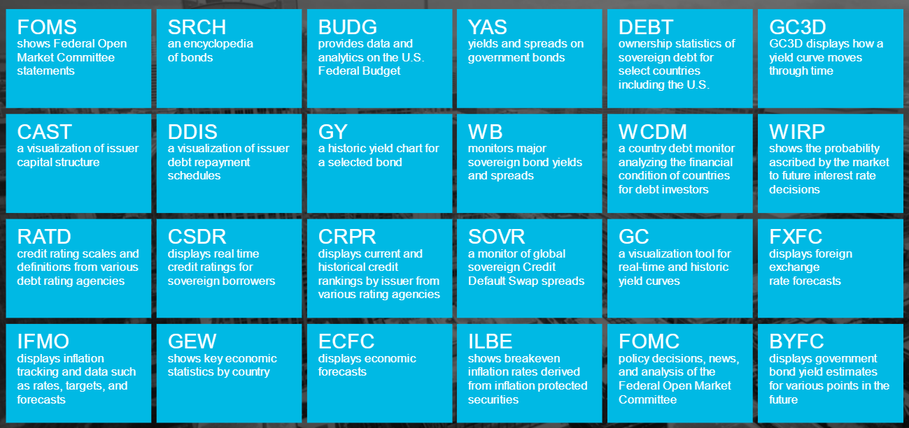
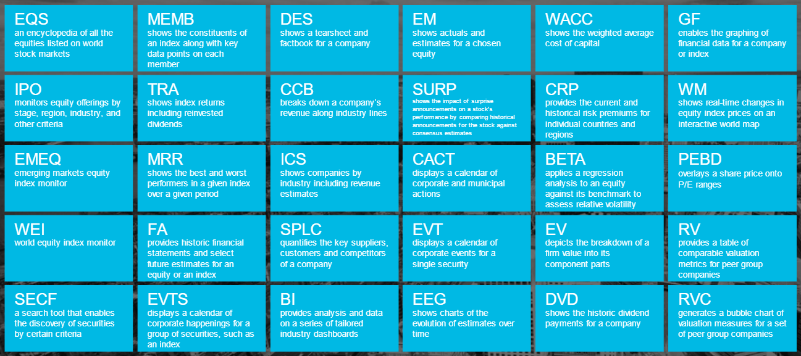

# Bloomberg Market Concepts

_Course Summary_:
- Economic Indicators
- Currencies
- Fixed Income
- Equities
- Terminal Basics
- Commodities
- Equity Options
- Portfolio Management

```
command line info
```

## Economic Indicators

GDP - Gross Domestic Product

### The Primacy of GDP

**The origins of GDP**

In 2000, the US Commerce Department called GDP. It's the main measure of economic activity.

```
type "world GDP"
```

World GDP grew at a compound rate of 8% per year, rising from $2T to $79T. This economic growth underpinned revenue growth across industries and growth in the financial markets and finance industry.

The United States overtook the United Kingdom to become the world's largest economy in 1872 and has remained so on an absolute dollar basis for well over 140 years.

The main unit of economic statistics is the nation state.

The Great Depression in 1930s in America, the WW2 forced the realization that better economic data was needed to support the war efforts through a deep understanding of manufacturing capacity and resource constraints.

GDP calculation in many istances is still a work in progress. Examples:
- in 1987 Italy decided overnight to include the black market in its numbers, and GDP rose by 17%
- in april 2014 Nigeria announced an 89% upward revision in Nigerian GDP after a grassroots measurement survey captured booming new industries such as Nollywood
- in 2013 the US further enhanced its reporting if GDP by breaking out tech spending (tech sector recognized and become more essential)

**Economic statistics**

The world's largest economies are awash with economic statistics.

The tools used to measure an economy often reflect what is important to that country's economy.

Personal consumption contributes over two-thirds of the US GDP. Therefore, analyzing trends in consumer spending and macroeconomic influences is vital to an investor.

When analyzing a security with heavy exposure to a certain country, it is helpful to use that country's economic data as an input to the investment process.

```
type "ECOW" [Economic Data Watch] function to find the most important data by country
```

**Essential economic indicators**

Five of the most important ones:
- Economic growth
- Inflation
- Unemployment
- Business confidence
- Housing

_Economic growth_

Gross Domestic Product: it's the market value of all final goods and services produced in a country. 

GDP = C + I + G + (X - M)

- C | personal consumption
- I | private investment
- G | government consumption
- X | exports
- M | imports
- (X - M) | net exports

```
"ECST" function, breakdown of the GDP
```

Nominal GDP growth takes into account both increases in production and increases in prices of goods and services.

Real GDP growth isolates increases in production.

Real GDP growth (%) = Nominal GDP growth (%) - Inflation (%)

A recession is defined as two successive quarters of negative real GDP growth.

The economy is cyclical.

_Inflation_

It is the general increase in the prices of goods and services which diminishes the purchasing power of money.

Inflation means that a unit of money tomorrow buys less than the same unit of money would buy today.

Inflation data in the US:

- PCE, monthly Personal Consumption Expenditures
- CPI, Consumer Price Index

PCE: report contains a measure of price changes in consumer goods and services. It also shows what consumers are spending their income on.

CPI: it's based on a representative basket of goods and services such as food, housing, and automobiles.

For CPI to be an effective measure of inflation, it needs to be truly representative of spending habits in that country.

When thinking about inflation it's important to remember that times change. Tastes change, technologies change, etc.

_Unemployment_

The economy tends to shrink when more people lose their jobs than get hired.

An overall increase in unemployment depresses GDP growth.

_Business confidence_

Business people tend to make large investments and hire people when they feel confident that there will be additional demand for their goods and services in the future.

The Institute for Supply Managements, or ISM, is an Arizona-based association that has the most widely followed index of US manufacturing activity - the Purchasing Managers Index, or PMI for short. Since the 1940s, the organization has regularly surveyed people in charge of buying goods and services for corporations about business conditions. The gauge is simple to understand: a reading above 50 signifies optimism, and below 50 pessimism.

PMI is also a good leading indicator of GDP growth.

```
"PMI indicator", select ISM Manufacturing PMI, then GP to see a chart, then overlay GDP growth
```

There is a strong relationship between the two. For most of the recessions shown, the PMI indicator dipped shortly before GDP declined.

_Housing_

The main indicator for residential housing construction is housing starts. House building accounts for only 3% of the US economy. But first, before homebuilders build houses, they need to believe that consumers are condifent enough to assume a 30-year mortgage. Second, after buying a new house, the new owners buy a lot of things for the house, this means that residential construction in reality contributes far more than 3%.

When we plot housing starts against real GDP growth, there is also a relationship.

**Summary**

All five of the measures we discussed are strong indicators of the health of the economy.

- The health of the economy sets the climate for investing and the number one barometer of economic health is real GDP growth
- Real GDP growth is cyclical and it is vital for investors to take a view on where the economy is in the cycle
- Developed economies have many economic indicators which serve as lenses for investors
- Indicators with predictive qualities are highly prized by investors

### Monitoring GDP

Real GDP growth is the most definitive and authoritative barometer of the overall economy.

After a quarter finishes it takes a month to come out with the preliminary calculation.

**Timeline of economic releases**

How investors make educated guesses of GDP growth as a quarter progresses:

1. take a look at the WECO, World Economic Calendar, to see a chronological list of economic indicators to be released after January 1
2. the first inkling that we have on how the US is doing comes from the PMI business confidence indicator. The Actual is the published economic indicator value, the column to the left of that, called Survey, is a median estimate from analysts of what the value of the economic indicator will be upon release. If an Actual exceeds the estimate, it is a pleasant surprise, and if it falls short of the estimate, an unpleasant surprise [published on the first business day of the following month]
3. the change in Nonfarm Payrolls is also monthly [published on the first Friday of the following month]
4. housing starts is another montly stat [published around the middle of the following month]
5. inflation - CPI - comes out monthly as well [published around the middle of the following month]

Unlike the other indicators, GDP is released every quarter, a month after the end of the quarter.

**The value of economic indicators**

The release of GDP statistics is less interesting to investors than the release of other economic indicators because GPD statistics are released well after other economic indicators.

**Summary**

- GDP releases in most countries tend to be quarterly and take a while for agencies to calculate
- By the time the official GDP statistics are announced, they tend to be yesterday's news
- Investors instead indirectly get a more timely feel for the economy through monthly economic indicators, many of which are strongly correlated with GDP
- The indicators that are published first, such as PMI and Nonfarm payrolls in the US, therefore attract the most attention

### Forecasting GDP

**Accessing economic forecast**

Highlights two further aspects of the WECO: first, the Relevance column indicates the volume of alerts that users have set up for each indicator. Therefore, the greater the investor interest, the greater the relevance. Second, the Survey column contains the analyst consensus forecast for that specific indicator.

Right click on the estimated survey amount, we can see how that consensus was calculated. The ECOS function shows the workings.

The yellow diamon signifies where the actual result was upon release.

Economists serve two very different roles when it comes to creating estimates.

First, they mantain estimates of what they think key economic indicator values will be in the short term. Second, they form opinions on the longer-term future for the most important economic statistics.

The distant future is inherently less knowable than the near future, and long-term forecasters have to take into account things like demographics, government policies, and technology.

**Spotting turning points**

Newspapers and politicians can spin anecdotes to their own ends. The plural of anecdote is data. Therefore, a material change in economic estimates from dozens of analysts often signifies that an important turning point has been reached. In this way, economic analysts at times offer a useful running verdict on how an economy is being managed.

**Using a mosaic to spot turning points**

Among the wealth of economic indicators, there is no silver bullet that consistently presages a turning point. But using several indicators in concert can lead to meaningful insights.

ECSU - Economics Surprise Monitor: consist of 40 hand-picked, meaningful leading indicators.

**Summary**

- Analysts publish forecasts of the most important economic indicators
- Long term economic estimates are used as inputs to a wide of array of financial models
- Economic optimism and pessimism can be directly observed through changes in economic estimates. Material changes in economic estimates often denote that an economy is a turning point
- No one economy is a silver bullet, but investors often creatively assemble mosaics of indicators to predict turning points



## Currencies

Currencies are the way the world keeps count.

Every security is denominated in terms of a currency, and therefore all investors make either explicit or implicit assumptions on currency violation.

### Currency Market Mechanics

**Growth of currency market**

```
type "trade flow" and select ECTR to see a database of trade flows between major countries 
```

The rise in global trade has increased the amount of currencies transacted.

Dealing with currencies used to be straightforward as they used to have pre-determined, locked exchange rates. This was in the wake of the 'Bretton Woods agreement', sealed by the WW2 allies in the US, where they all agreed to lock their currencies to the US dollar. The US dollar in turn was convertible into gold at a price of $35 per ounce, with gold available on demand from Fort Knox in Kentucky. This was the so-called 'Gold standard'.

In the wake of the Vietnam War, the US economy stagnated and this attempt to lock currencies ended when president Nixon unilaterally announced in 1971 to suspend this convertibility of the US dollar into gold.
This decision created the mdoern fiat currency regime. Today, more than $5T is transacted each day in the world foreign exchange market, otherwise known as the FX or forex market.

They say on Wall Street that money never sleeps. Unlike other markets, the currency market operates 24 hours a day during the business week.

```
type "FX24"
```

The only gap in trading occurs on the weekend.

Approximately three weeks' worth of global currency transactions amounts to world annual GDP.

**Who trades currencies**

There are three main entities that trade currencies. Here they are, in descending order of volume:

1. Financial investors; buying and selling securities in foreign currencies

Financial investors are by far the largest bucket of users with 45% of the volume being driven by banks, security firms, and institutional investors. This is commonly known as "hot money".

2. Corporations; conducting global business selling goods and services accross borders
3. Travelers; millions of people that change currency for personal use

**Pegged currencies**

Currency conversion calculations are easy when one cuntry locks its exchange rate to a major currency (like in 1944). This is often done to offer the impression of certainty to businesses and consumers.

```
type "pegged currencies, get the PEG function and see a table of currencies that are linked, or pegged, to other countries' currency values.
```

Currency values are determined by the law of supply and demand. One of the key mechanisms that governments use to peg currencies is what is known as FX reserves - a huge stack of cash with which to manipulate the supply of and demand for a currency and therefore manipulate its value.
The US dollar is the most common currency used to build FX reserves as it is the most liquid currency.

In addition to FX reserves, governments also lift interest rates to defend pegs.

**Floating currencies**

The values of currencies that are not pegged fluctuate in the world currency market. The values are expressed in terms of how much of one currency is needed to buy another.

```
type "currency codes", select the FX Ticker Finder or FXTF function, to see a list of all 155 unique currencies
```

This means that there are in theory 11'935 possible currency pairs.

When referencing the value of a currency pair, you need to be careful if you're expressing how many units of currency A equate to one unit of currency B or if you're expressing how many units of currency B equate to one unit of currency A. In other words, is currency A the numerator or the denominator?

```
type "FX" to pull up FXC, or the Currency Rates Matrix, to find currency pair values
```

**Triangular arbitrage**

The currency pairs floats in a matrix and they trade in 'lockstep'. We cannot convert from a currency to another currency to another currency and back to the first currency and make money. This is due to a process called traingular arbitrage, keeping the currency matrix coordinated.

Typically, when converting from one low volume currency to another, investors will transact through the US dollar. Accordingly, the Bank for International Settlements estimates that 85% of all FX volumes involve the US dollar.

**Summary**

- According to the Bank for International Settlements, over $5T of currencies are transacted each day
- Currencies used to be locked to the US dollar which, in turn, was locked to gold at $35 per ounce in 1971, the US suspended this gold conversion windows and many currencies started floating freely. This was the dawn of the modern currency market.
- Several countries peg their currencies to those of other countries (typically the US dollar or the euro) in order to foster stability and contain inflation
- Pegs are problematic when the economic performance of the pegged currency deviates from that of the country it is pegged to
- Non-pegged currencies float in a matrix of currency pairs kept in check by a process called triangular arbitrage
- 85% of all FX trades involve the US dollar, and US dollars are typically used to build FX reserves due to their liquidity and stability. The US dollar is frequently used as a central currency through which two less liquid currencies are converted

### Currency Valuation

**Observing currency strenght**

To determine the overall strenght or weakness of a single currency, we use what are known as 'trade weighted baskets', which are indices which calculate the aggregate value of one currency against its main trading partners. Larger trading partners are weighted more heavily.

```
type "tradeweighted"
```

Theory states that in the long run, identical goods and services should cost the same no matter where they are sold around the world. This is known as the "law of one price". In 1986, the Economist Magazine released the famous "Big Mac index".

The Big Mac index is predicated on the law of one price. It uses the price of Big Macs in the capitals of the world as a proxy to demonstrate currency under and over valuations.

**Three main currency drivers**

Many factors can move currencies in the short term including news events, economic surprises, and large order flows, such as a substantial international company acquisition.

We are going to focus on the following three factors that drive the levels of currencies:
- Surprise changes in interest rates
- Surprise changes in inflation
- Surprise changes in trade

_Surprise changes in interest rates_

Say a global investor found the price on a particular government's bonds appetizing. In order to buy those bonds, the investor would have to exchange his domestic currency for the currency of the government in question. Therefore, all else being equal, surprise rises in interest rates in one country relative to another will cause the first currency to strenghten.

_Surprise changes in inflation_

The laws of supply and demand dictate that scarcity drives value while abundance diminishes value. This is true in the world of currencies where excess money supply leads to inflation.

When the money supply of one currency expands more rapidly than that of another, the exchange rate of the first will tend to depreciate against the second. All else being equal, surprise rises in inflation, therefore, will weaken a currency.

_Surprise changes in trade_

Recall the formula for GDP [GDP = C + I + G + (X - M)]. X represents exports and M represents imports. When a country exports goods, the foreign buyer needs to buy the currency of the exporter. When the country imports goods, the importer needs to buy the currency of the foreign seller by selling the home currency. Therefore, if net exports is positive, the country has a trade surplus and it will drive demand for the home currency. If net exports is negative, the country has a trade deficit and it will diminish demand for the home currency.

Any surprise, therefore, in a trade surplus or a trade deficit can alter the value of a currency because it changes the demand for a currency.

**Summary**

- Since the breakdown of the link between paper currencies and gold in 1971, currency valuations have been purely relative between the paper currencies. When quoting a currency value, it's important to understand which currency is the numerator and which is the denominator
- A close approximation to absolute currency valuation is provided by trade-weighted baskets
- In the long run, goods and services should cost the same no matter where they are in the world
- In the short run, which is more important to most investors, these are three of the principal drivers of currency valuation:
  - Surprise change in interest rates; this is because all else being equal, currency with higher interest rates are more attractive
  - Surprise change in inflation; this is because all else being equal, currency with lower inflation are more attractive
  - Surprise change in trade; this is because all else being equal, countries that are major net exports have more attractive currency

### Central Banks and Currencies

Of our currency driver surprises, two of the three - interest rate expectations and inflation expectations - are strongly influenced by central bankers through their rate-setting agenda.

**The inflation vicious cycle**

```
type "inflation monitor"
```

The principal goal of most of the world's major central banks is to guard against inflation and, in rare cases, deflation. The typical target rate of a developed economy is to have inflation of about 2%.

Low but positive inflation is typically a plus for economies. It protects consumers' purchasing power, keeps borrowing costs low, and provides a stable backdrop for businesses to make investment and hiring decisions.

Inflation targeting is not as easy as it sounds because inflation is psychological.
Vicious cycle: workers expect prices to increase -> workers demand pay increases -> company wages go up -> companies raise their prices -> workers expect...

Sometimes central bankers need to take extreme measures to break the cycle. And these measures typically affect currency exchange rates.

**The deflation vicious cycle**

Classic example of deflation is the Great Depression in the US in 1930s.

Like inflation, deflation is also a vicious cycle. Vicious cycle: prices decline -> consumers defer purchases to await lower prices -> company revenues decline -> companies let go of workers to cut costs -> prices decline...

**Summary**

- Central bankers control short-term interest rates, which affect both inflation and international investment flows. Central bankers are thereby pivotal to currency violation
- Developed economies typically target 2% inflation in an effort to guard against both inflation and deflation
- If inflation takes hold, it can be very hard for the central bank to contain, once prices start to rise and workers receive catch-up pay increases, which push prices higher still
- Deflation is rarer than inflation but sets off a vicious cycle whereby businesses and consumers defer purchases, leading to further economic weakness

### Currency Risk

**The inconvenience of currency volatility**

Currency movements can wreak havoc on corporations and investors.

**Tools to assess currency risk**

There are two tools for investors to assess currency risk:
- Historic volatility of currency pair values
- Analyst forecasts of currency pairs

_Historic volatility of currency pair values_

The FX Forecast Model, FXFM, illustrates the chances of certain currency rates in a selected future timeframe. This is derived from historic observations of the movements of the selected currency pair.

What it shows is the frequency distribution of past movements in the currency pair over a given period. This allows us to estimate the volatility we may expect over the same given period into the future. It is based on the assumption that history repeats itself. A currency pair with a high volatility has a wide bell curve.

_Analyst forecasts of currency pairs_

The second way to analyze currency risk is to examine Foreign Exchange Forecasts, accessible via the FXFC function.

Investment banks have teams which forecast the values of currency pairs. For the world's major currency pairs, teams will typically forecast the rate for the next few quarters and the next few years.

Where do these forecasts come from? They are the average of the estimates of various investment bank analyst teams.

**Hedging currency risk**

Investors have the option of locking their currency exposure for long periods using the currency forward market.

How? In the liquid global currency market, there is a wide diversity of beliefs about the future. You can frequently find someone to bet against.

The FX Forward Calculator, FRD, shows us the forward exchange rates for a selected currency pair. It is used by those looking to hedge (to reduce risk) or to speculate (to seek risk).

**Gold: the ancient currency**

Gold has traditionally been a safe haven asset that people turn to in times of crisis to store value. It is a non yielding asset, meaning that it pays no dividends or interest, and is expensive to store. It is typically times of crisis that cause investors to appreciate its charms. It is durable, rare, and - unlike paper money which can be printed on a whim by a government - it is not able to be manipulated by any government. Gold is therefore viewed as an inflation hedge.
Holding paper currency, on the other hand, is a leap of fait, trusting that it will not be manipulated by the government that issues it.

Oddly, despite paying no dividends or interest, and costing a lot to store, gold - the so-called "barbarous relic" - has had an immensely durable perception of value through the course of human history.

**Summary**

- Corporation and investors making cross border movements are frequently buffeted by currency movements
- There are two key ways to understand currency risk: observing historic volatility and examining currency rate forecasts
- Investors and corporations can use forward agreements to lock in currency rates in the future. This is facilitated by the differing opinions of the future among market participants. If investors have a belief about future currency rates materially different from the consensus, there may be an opportunity to lock the rate
- Paper currencies can be manipulated by the issuing government while gold cannot. Through time, gold has enjoyed a durable perception of value in the eyes of investors



## Fixed Income

Fixed income is another word for the bond market, and while the bond market may appear arcane, it plays the crucial role of setting the price of borrowing and lending to governments, businesses and consumers.

### The Roots of the Bond Market

**Size of the bond market**

Fixed income is a fancy term for borrowing and lending.

The fixed income market is the biggest market in the world.

```
Fixed Income Search, or SRCH, to look at Bloomberg's encyclopedia of bonds
```

**History of the bond market**

The fact that the US, therefore, hosts a fifth of the world bond market is one of the main reasons for the dollar centricity of the currency market.

Despite its size, the bond market is, like the FX market, a relative recent phenomenon. It was born out of interest rate liberalization and the removal of capital controls after the WW2, which made it easier for government to borrow.

The biggest segment of the world bond market is the government bond market, also known as the sovereign debt market. Governments historically used to raise money for only a few outlays, such as spending on war and justice.

With the advent of the welafare state and social safety net, government spending as a proportion of GDP has risen steeply as advanced nations now pay more for healthcare, education, and other public services.

**Government budget deficits**

```
BUDG - budget function; orange line represents outlays, white line represents tax receipts. When the orange line is above the white line, the government is spending beyond its means and needs to borrow to fill the gap. This is known as a budget deficit.
```

**Government indebtedness**

```
type "Treasury Securities" to pull up the total amount of government debt, according to the federal reserve.
```

**Foreign owners of government debt**

```
type "Sovereign Debt Ownership" to see the owners of US government debt securities
```

Since currencies floated freely since 1971, many countries have been forced to accumulate war chests of FX reserves to defend their pegs or to scare off speculators. Meanwhile, other countries have sold their own currencies to buy US government bonds in order to weaken their currency.

Those countries that need FX reserves use US treasures as a safe and easily accessible place to park their money.

US government bonds are widely viewed as the safest financial asset on earth. The US has the strong reputation for creditworthiness as it has the right to tax the citizens and businesses of the wealthiest country on earth. In addition, the US has the so-called "exorbitant privilege" of being able to print the world's reserve currency. The US could ultimately pay everybody back by either increasing taxes or simply printing its widely-trusted cash.

US government bonds are the most liquid tradable assets on earth and are naturally US dollar-denominated. Conveniently, the FX market is also US dollar-centric. This makes US government bonds the proverbial piggy bank for the world.

Investors also use US government bonds as a safe haven during times of turnoil.

The commonly accepted indicator of market turmoil is the VIX volatility index - otherwise known as the world's "fear gauge". When the VIX is high, investors are scared, when low, complacent. Bond prices move inversely to bond yields.

**Corporate bonds**

Of the 2.1 million tradable bonds in the world, corporates is the other major segment and is again a recent phenomenon.

Given that there are far more large companies in the world than there are governments, there is a greater diversity of corporate bonds than government bonds.

Companies borrow in the corporate bond market for two reasons:

First, in almost all countries, a discrepancy in tax treatment means that debt repayments lower a company's tax bill by reducing pre-tax profits through interest payments. As there is a corporation tax on company profits of over 20% in many advanced economies, being financed with debt saves a company money.

Second, companies can borrow money for longer terms from the bond market than from banks, which are not typically keen on making long-term loans to corporations.

**The structure of a bond**

It is effectively an "I owe you" note which promises to make regular fixed amount payments - called coupons - and a large payment at the end of the loan - called the principal.

**Introducing bond yields**

Fixed income only means fixed repayments amounts - and, even then, only provided the borrower actually pays you back!

The latest calculation of the APR is called the yield. The main input to the yield is the price of the bond and this fluctuates. The other input is whatever bond repayments are yet to happen in the future. Over time, as the bond gets repaid, the amount of remaining repayments decreases. These remaining repayments along with the floating price of the bond are used together to calculate the yield.

**Relationship between yields and prices**

In general, the lower the agreed purchase price for a bond, the greater the APR, or yield, as a smaller up-front sum results in the same fixed amount repayments down the road.

When the price of a bond goes down, the APR - or the yield - goes up. And when the price of a bond goes up, the APR - or yield - goes down.

**Summary**

- Fixed income, or "the bond market" are fancy words for the trading of loan agreements
- Fixed income is called fixed income beacuse the borrower promises to pay fixed, pre-agreed repayments at future dates
- The increased spending of governments over the last century is the main growth driver of the largest market in the world
- US government bonds are the basic building blocks of the financial markets because they are safe and liquid
- Fundamentally, investors care about the income that bonds provide, and thus bonds of all shapes and sizes are compared using their yields

### Bond Valuation

**Illustration of a bond yield**

Earning interest on interest is known as compound interest.

Bond yield: the equivalent interest rate on a bank account that would provide an identical pot of gold at the end of the rainbow.

**How to guess a bond yield**

Shortcut to extracting the yield on a bond from the bond terms: either using the Internal Rate of Return function or simply looking at the Bloomberg Yield and Spread function YAS, and reading off the pre-calculated yield.

**Deciphering bond yields**

Think of bond yields therefore as nothing more than advertised deposit rates in the window of the bank.

The difference is that the rates on offer to new buyers of the bond will move as the price of the bond moves.

**Bond valuation drivers**

There are two key drivers:
- credit risk
- macroeconomics

_Credit risk_

Bonds are reliant on the borrowers' ability and willingness to repay. Sometimes even governments default on their bonds.

When bond investors ("lenders") begin to doubt the creditworthiness of a borrower, yields move sharply upwards.

The yields partly reflect the market's view of wheter the debts are likely to be repaid. If the market believes that a government may have trouble paying the money back, the price of the bond will be lower and, therefore, the yield higher. This makes future borrowing more expensive for this government.

Credit risk factors:
- Debt/GDP
- Deficit/GDP
- Repayment schedule

All three metrics have the power to make investors demand higher yields in government bond auctions. Often a government debt crisis will involve more than one of these factors: government debt as a proportion of GDP, government budget deficit as a proportion of GDP, and the aggressiveness of the repayment schedule.

Debt/GDP:

when a government borrows to build a project, the project payments contribute to GDP. When a government ultimately pays off the resulting debt, however, these repayments are not counted as part of GDP. They're merely paying back money borrowed to buy goods and services in the past, meaning that the GDP growth from those goods and services has already happened. Therefore, when a government borrows and spends, it drives GDP growth. But when the debt comes due, debt repayments inhibit GDP growth. And the greater the debt as a proportion of GDP, the greater the debt repayments and, therefore, the greater the drag on the economy.

Deficit/GDP:

a second major indicator of creditworthiness is the extent to which the government is living beyond its means as measured by the budget deficit as a proportion of GDP. Deficit to GDP takes the annual government budget deficit, divides it by GDP, and expresses it as a percentage. Government with deficits have negative deficit to GDP ratios.

The higher the deficit as a percentage of GDP, the higher the rate at which the government is racking up new debt.

Repayment schedule:

the aggressiveness of the repayment schedule of the debt. Asking whether the lender thinks that, timing-wise, the borrower will have the cash available when the repayments come due.

Government can borrow short term or long term. Generally, borrowing over the short term attracts a lower annual interest because it lower risk for the lender.

Credit risk indicators:
- Credit ratings
- Credit default swaps

Credit ratings:

there are several credit rating agencies that rate bonds. Standard & Poor's (S&P) -> highest level of creditwothiness is AAA, lowest level is D, which stands for default.

Rating agencies also rate corporate bonds. The lower risk/higher rated corporate bonds with at least a BBB-rating or above are called "investment grade". The higher risk/lower rated corporate bonds, BB+ and below, are called "non-investment grade", "speculative", "high yield", or simply "junk".

The track record for credit rating agencies is decidedly patchier for corporate bonds than it is for government bonds.

Credit default swaps:

an alternative to monitoring credit ratings, it became popular since the Enron debacle. CDSs are a form of insurance against governments and corporations going bust.

CDSs often provide a more timely warning of impending default than credit ratings. This is because they are "real-time" readings based on traded instruments. The higher the CDS spread, the higher the risk.

Since the early 2000s, credit default swaps have also been available on government bonds.

CDS spreads should reflect the intrinsic probability of default.

_Macroeconomics_

This drives yields via short-term interest rates and inflation.

Inflation has a corrosive effect on the price of fixed income instruments.

Inflation is bad news to bondholders or lenders, such as savers and insurance companies. On the flipside, borrowers benefit from rising inflation.

**Summary**

- Bond yields facilitate comparison between bonds by calculating what an equivalent bank deposit rate would be for the duration of the bond
- The three biggest risks facing bond holders are the borrower not paying you back, having inflation eat into the repayments, and a rise in interest rates pushing down the price of the bond
- The see-saw relationship between prices and yields instills discipline in governments because investor worries about not getting paid back makes future borrowing more expensive for less-creditworthy governments
- Short-term borrowers tend to be charged lower interest rates but the risk is that those rates can go up when they roll over the debt
- Inflation is corrosive to bondholders as it diminishes the purchasing power of the repayments. It therefore sends bond prices down and bond yields up
- US government bonds are admired for their lack of credit risk. Therefore, all other bonds have to be priced competitively with US government bonds

### Central Bankers and Interest Rates

**Central bank mandates**

One of the main goals of central banks in setting interest rates is to protect the currency from inflation and the economy from the spiraling ill-effects of runaway inflation and deflation.

Once inflation takes hold, it is hard to tame. This is because it is psychological. Once expectations of price increases become ingrained, they are hard to unseat.

The Cato institute estimates that there have been 56 bouts of runaway inflation ever recorded. The most extreme forms are driven by war.

Deflation can also lead consumers to defer purchases. (remember the vicious cycle)

**Central bank decision-making**

_Inflation measures_

Central banks review the inflation statistics, particularly the following three:
- The "GDP deflator" from the quarterly GDP report
- The less accurate but more frequently reported monthly CPI statistics
- The favorite inflation gauge of the Federal Reserve, "core personal consumer expenditure" which strips out the volatile costs of food and energy

These data sets are historic.

Since 1997, there have been exotic instruments which are called Treasury Inflation Protected Securities, "TIPS". Instead of having "fixed-income" payments to the lender, TIPS compensate the lender in the event of inflation, using CPI as a guide.

By comparing the price of this bond with the price of a similar non-inflation-protected bond, investors can glean inflation expectations. The higher the expected inflation, the greater the investor demand for TIPS relative to normal bonds. Therefore, the greater the difference in yield between the two bonds.

_The output gap_

It is the difference between the economy's potential output and its actual output. Tightness in the economy frequently coincides with inflation, while slackness frequently coincides with deflation. Central bankers use this output gap measurement to detect an emerging inflation or deflation problem.

**Central bank toolkit**

Once central bankers have made a decision, what tools do they have at their disposal?
One way is to print vast amounts of money. Other two tools that they commonly use are adjusting short-term interest rates and making public statements about interest rate policy.

_Short-term interest rates_

When short-term interest rates go up, it becomes more attractive to deposit cash. This dissuades consumption and investment. Therefore, rate hikes slow growth and contain inflation.

_Statements_

Any statement that hints at a course of interest rates that is different from what the market is expecting will move bond yields. Investors will go so far as to put a new Fed statement next to the old one to look for minute changes.

**Summary**

- Both inflation and deflation have a natural tendency to spiral out of control, and it is the job of central banks to stop that from happening
- In the 1960s and 1970s, inflation was high around the world, which made bonds a terrible investment. Ever since then, bond investors have been keenly attuned to any sign of inflation
- Central banks not only study inflation statistics but also measure the difference between actual and potential economic output to look for impending inflation or deflation problems
- Central banks have two main tools to regulate money supply - interest rates and their influence over where consumers and businesses believe interest rates are headed
- Short-term interest rates have proven to be somewhat effective over the past few decades to course-correct economies around the world

### The Yield Curve and Why It Matters

**Defining the yield curve**

A visual representation of the cost of borrowing.

The x-axis is the bond's maturity, ranging from 1 month all the way to 30 years. The y-axis is the bond's yield: the interest rate that an investor would get per year from holding that bond for the full life of the bond.

The x-axis doesn't signify the passage of time, but rather bonds of varying maturities.

**Term premium**

The difference between the yield on the longer-maturity bonds and shorter-maturity bonds is called the "term premium". This is the extra yield that investors demand for holding longer-term bonds.

**Ripple effects of the yield curve**

_Corporate impact_

Almost all corporate investment projects are multi-year. They are, therefore, typically funded with medium or long-term borrowing to match the project duration.

Lenders to companies face the same risks as lenders to governments. In addition, lenders to companies face the elevated risk of the companies going bust.

Companies are less creditwhorthy than governments. Therefore, corporate bonds typically have higher yields than government bonds of the same maturity. This is called "the spread". A spread measures how much more a business pays to borrow money than the government does.

_Consumer impact_

_Global impact_

**Summary**

- The yield curve is a depiction of the cost of borrowing for various periods of time
- The natural order is for the yield curve to go from bottom left to top right because there is a greater chance of stuff going wrong over the long run
- When companies borrow, the interest rates on the bonds are set in reference to the government borrowing rate
- When consumers borrow to male big-ticket purchases, the interest rate they pay is also set in reference to the government borrowing rate
- The correlation between government bond yields around the world has the tendency to link economic performance of the major economies

### Movements in the Yield Curve

**The yield curve in motion**

The left-hand end is set by the Fed's short-term interest rate decisions. It moves when the Fed changes the rate at the FOMC meeting.

The right-hand is driven by beliefs in long-term economic prospects such as:
- interest rates
- GDP growth estimates
- demographics
- demand for borrowing
- supply of lending

One of the most powerful drivers of long-term yields is ingrained inflation expectations as inflation is powerfully corrosive to bond prices.

So to summarize, the left-hand end of the yield curve is driven by short-term interest rates and the right-hand end is strongly influenced by inflation expectations.

Predicting how the yield curve will move is helped by two key indicators. WIRP helps you predict the left-hand end while ILBE helps you predict the right-hand end.

**Summary**

- The left-hand end of the yield curve is simply set by the central bank, and so it only moves when the central bank changes interest rates
- The right-hand end of the yield curve is set by bond traders' beliefs of future interest rates and inflation
- While the left-hand end of the yield curve is locked, the right-hand ends floats freely. This means that the gradient of the curve is rich with meaning
- As the economy improves, bond traders think rates will go up to rein in inflation and so they sell longer-term bonds in anticipation of price declines. Prices down, yields up, curve steepening
- And viceversa. As the economy deteriorates, bond traders think rates will go down so they buy longer-term bonds in anticipation of price increases. Prices up, yields down, curve flattening
- If the economy is in really poor shape, bond traders may push the long end down so much that the curve becomes downwardly sloping - often an indicator of impending recession



## Equities

The stock market is a primary source of financing for large and medium-sized corporations. It is famously volatile. This is because there are so many factors that affect share prices - not only how well a company is doing, but also other drivers such as the valuation of its peers, trends in its industry, and the state of the broader economy.

### Introducing the Stock Market

**Stock market volatility**

Equities, stocks, and shares all mean the same thing - part ownership of a company. And the stock market - where these part ownership are bought and sold - is what most outsiders envision when you say "finance".

**Purpose of the stock market**

Their purpose is to allocate resources to productive enterprise. Over time, the fastest growing, most profitable businesses will have access to the most funding. The stock exchange is appealing for two reasons:
- Just as the bond market makes it easy to enter and exit loan agreements, the stock market makes it easy to enter and exit company investments. A private investor can quickly and easily own parts of thousands of companies
- By buying shares in a company, you will ultimately earn the underlying commercial returns of the company

**Total market value**

The world equity market is smaller than the world bond market both in terms of total value and total number of securities. At the end of 2016, the bond market was worth $101T while the equity market was worth only $65T.

Only a small part of the corporations are listed in the equity market. Listed equities tend to be the larger corporations.

**Initial public offerings**

These few companies go public in the first place typically to raise money to expand the business, or to enable the founders or owners to sell their stakes to the public. Or both.

Companies lists through initial public offerings, otherwise known as IPOs.

_Delistings_

While equities list in splashy IPOs, they tend to delist more discretely. They can delist for many reasons:
- the company may have been bought by a private equity fund
- management may have been fed up with the regulatory burden of being a public company
- the company may have gone bust
- or a whole industry may have died

Not all delistings are for a negative reason. For example, a company delisted when another one bought it, and that deal was considered a plus for both companies.

In recent history, there have been more delistings than IPOs.

**Market monitoring - Indices**

Investors keep tabs on overall world stock market movements by using indices.

There are more equity indices in the world than there are the equities that compose them. Equities indices can also tell you whether a money manager has beaten the market.

_Index composition_

The members of an index can be sliced and diced in many ways.

_Index membership criteria_

Company size, industry, and country are the three most common organizing principles for stock market indices. Size determines the membership of the S&P 500, for instance. Market capitalization, which is the total value of shares outstanding, is the main metric used to determine whether a stock should be in the S&P 500.

_Index weight_

Size is also used to determine how much it contributes towards the moves in the index.

The index weight tells you how much the performance of one stock will contribute to the performance of the overall index. In many equity indices, the index weight is the market cap of one stock divided by the total market caps of all stocks in the index.

**Summary**

- Companies list on the stock market through initial public offerings for several reasons, such as raising money to expand or enabling the owners to sell their stakes
- Companies delist from the stock market for several reasons, such as when they are acquired, when they go bankrupt, or when they decide that being a public company is too onerous
- Investors keep track of the stock market through indices, which can track many things such as a particular country, industry, or companies of a certain size
- The weighted performance of index members determines the performance of the index itself

### The Nature of Equities

A bond is a tradeable loan that entitles you to fixed repayments in the future. An equity is also an entitlement to future cash flows, albeit very different ones from fixed income. While a bond promises fixed income repayments, an equity promises residual cash flows from a company - that is, what is left when all other claims are satisfied. These claims include payments to suppliers, compensation to employees, repayments to lenders, and payments to the government in the form of taxes.

_Factors to consider when comparing returns_:
- the role of dividends in equity returns
- the nominal nature of stock and bond returns

**Summary**

- Equities confer the right to residual earnings and net assets of a company
- Stocks are more volatile than bonds because earnings are volatile and not preordained, unlike fixed income repayments
- Shareholders benefit in two ways from owning shares. The price may go up and they may get regular dividens payments as well
- The range of possible returns for shareholders is asymmetrical. The most equity investors can lose is 100% (everything), but, on the flipside, they can multiply their original investment by hundreds of percent if the company does well

### Equity Research

_How to estimate future company earnings_:
- industry classification
- suppliers and buyers
- revenue projections
- cost base

**Summary**

- Each industry has its own outlook. Therefore, the first question that an analyst must ask when valuing a company is "What industry or industries does the company operate in?"
- Financial projections require industry market sizing estimates, market share forecasts, and cost breakdowns
- Analyst look for causal, intuitive linkages to understand historic company performance, and these drivers are foundational to earning estimates
- Revenues, costs, and earnings are disclosed in company results announcements. The results are then compared to estimates to determine how well a company is doing

### Absolute Valuation

_Assessing fair market capitalization_:
- absolute valuation
- relative valuation

**Summary**

- Absolute valuation involves the long-term guesstimation of company profits and the calculation of how much those profits are worth today. The main driver, therefore, is how well you think the company will perform
- One hundred dollars in ten years' time is worth less than one hundred dollars in two years' time. A bird in the hand is worth two in the bush
- Financial models are simplifications of reality. The trick is to be simple enough to be understood while being complex enough to approximate reality. Simple, not simplistic
- The advantages of absolute valuation are its precision, rigor, and link to the fundamental performance of the company
- The absolute valuation process is undermined by the need to make long-term predictions and the sensitivity of the outputs to a few key inputs

### Relative Valuation

|   | Absolute Valuation | Relative Valuation |
| - | ------------------ | ------------------ |
| PROS | Precise | Easier to understand |
|   | Anchored to earnings | Simple to calculate |
|   | Disciplined thought process | Does not demand long-term forecasts |
| CONS | Demands clairvoyance | Directional |
|   | Laborious | Hard to find truly comparable companies |
|   | Prone to subtle manipulation | Presupposes that the company you are comparing it to is itself fairly valued |

_Metrics_:
- dividend yield
- P/E

_Application_:
- self
- peers
- market

_Differences between dividend yields and bond yields_:
- dividends payments may vary while bond payments usually do not
- dividend yields are easier to calculate than bond yields

**Summary**

- Relative valuation is quick, easy, and intuitive. It involves comparing the company in question to its own historic valuation, to its peer group, or to the market
- The drawbacks are its imprecision, its subjectivity, and its inability to spot generalized under or overvaluation
- Investors calculate what they think share prices should be by multiplying the estimated earnings per share by what they consider a fair P/E ratio. Therefore, share prices yo-yo for two reasons: changes in earnings and changes in the P/E ratio
- Determining a fair P/E ratio hinges on how fast you think company earnings will grow. A fast-growing company likely warrants a higher P/E ratio than a company in decline
- The most important driver of share prices is earnings growth. This is strongly influenced by the state of the relevant economies

