# Google - Machine Learning crash course

### Framing

**Key ML Terminology**

ML systems learn how to combine input to produce useful predictions on never-before-seen data.

- Label: a label is the thing we're predicting
- Feature: a feature is an input variable; a simple machine learning project might use a single feature, while a more sophisticated machine learning project could use millions of features
- Example: an example is a particular instance of data, x. We break examples into two categories: labeled examples and unlabeled examples
- Labeled example: a labeled example includes both feature(s) and the label. Use labeled examples to train the model.
- Unlabeled example: an unlabeled example contains features but not the label
- Models: a model defines the relationship between features and label
- Training means creating or learning the model
- Inference means applying the trained model to unlabeled examples
- A regression model predicts continuous values
- A classification model predicts discrete values

### Descending into ML

**Linear Regression**

Linear relationship: y = mx + b

where:
- y | the value we're trying to predict
- m | the slope of the line
- x | the value of our input feature
- b | the y-intercept

By convention in machine learning, you'll write the equation for a model slightly differently: y' = b + w_1 x_1

where:
- y' | is the predicted label (a desired output)
- b | is the bias (the y-intercept), sometimes referred to as w_0
- w_1 | is the weight of feature 1. Weight is the same concept as the "slope" m in the traditional equation of a line
- x_1 is a feature (a known input)

Although this model uses only one feature, a more sophisticated model might rely on multiple features, each having a separate weight (w_1, w_2, etc.). For example, a model that relies on three features might look as follows: y' = b + w_1 x_1 + w_2 x_2 + w_3 x_3

**Training and Loss**

Training a model simply means learning (determining) good values for all the weights and the bias from labeled examples. In supervised learning, a machine learning algorithm builds a model by examining many examples and attempting to find a model that minimizes loss; this process is called empirical risk minimization.

Loss is the penalty for a bad prediction. That is, loss is a number indicating how bad the model's prediction was on a single example. If the model's prediction is perfect, the loss is zero; otherwise, the loss is greater. The goal of training a model is to find a set of weights and biases that have low loss, on average, across all examples.

The linear regression models we'll examine here use a loss function called squared loss (also known as L_2 loss). The squared loss for a single example is as follows:

```
the square of the difference between the label and the prediction = (observation - prediction(x))^2 = (y - y')^2
```

Mean square error (MSE) is the average squared loss per example over the whole dataset. To calculate MSE, sum up all the squared losses for individual examples and then divide by the number of examples:

MSE = $\frac{1}{N}\sum (y - prediction(x))^2$

where:
- (x, y) is an example in which
  - x is the set of features that the model uses to make predictions
  - y is the example's label
- prediction(x) is a function of the weights and bias in combination with the set of features x
- D is a data set containing many labeled examples, which are (x, y) pairs
- N is the number of examples in D

### Reducing Loss

**An Iterative Approach**

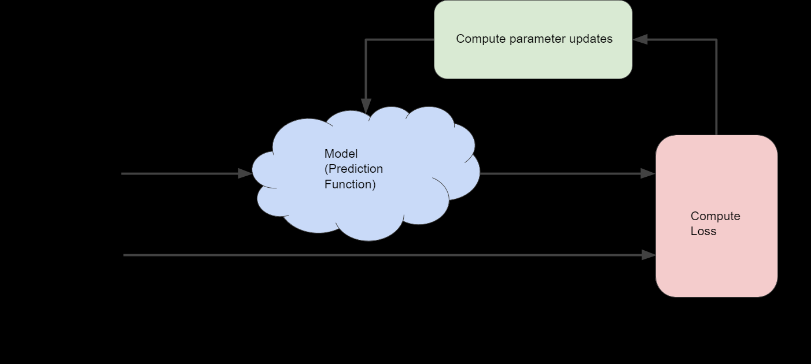

Usually, you iterate until overall loss stops changing or at least changes extremely slowly. When that happens, we say that the model has converged.

**Gradient Descent**

Suppose we had the time and the computing resources to calculate the loss for all possible values of w_1. For the kind of regression problems we've been examining, the resulting plot of loss vs. w_1 will always be convex. In other words, the plot will always be bowl-shaped, kind of like this:

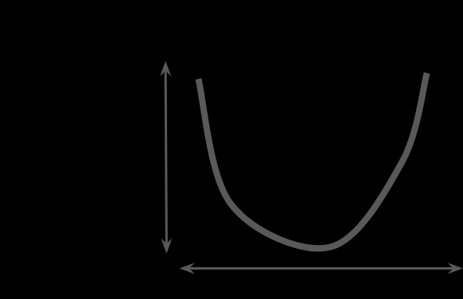

Convex problems have only one minimum; that is, only one place where the slope is exactly 0. That minimum is where the loss function converges.

The first stage in gradient descent is to pick a starting value (a starting point) for w_1. The starting point doesn't matter much; therefore, many algorithms simply set w_1 to 0 or pick a random value.

The gradient descent algorithm then calculates the gradient of the loss curve at the starting point.

Note that a gradient is a vector, so it has both of the following characteristics:
- a direction
- a magnitude

The gradient always points in the direction of steepest increase in the loss function. The gradient descent algorithm takes a step in the direction of the negative gradient in order to reduce loss as quickly as possible.

To determine the next point along the loss function curve, the gradient descent algorithm adds some fraction of the gradient's magnitude to the starting point as shown in the following figure:

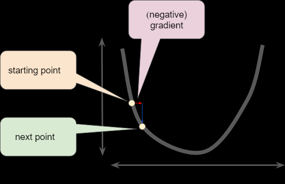

The gradient descent then repeats this process, edging ever closer to the minimum.

**Learning Rate**

As noted, the gradient vector has both a direction and a magnitude. Gradient descent algorithms multiply the gradient by a scalar known as the learning rate (also sometimes called step size) to determine the next point.

Hyperparameters are the knobs that programmers tweak in machine learning algorithms. Most machine learning programmers spend a fair amount of time tuning the learning rate.

**Optimizing Learning Rate**

ex

**Stochastic Gradient Descent**

In gradient descent, a batch is the total number of examples you use to calculate the gradient in a single iteration.

By choosing examples at random from our data set, we could estimate (albeit, noisily) a big average from a much smaller one. Stochastic gradient descent (SGD) takes this idea to the extreme--it uses only a single example (a batch size of 1) per iteration. Given enough iterations, SGD works but is very noisy. The term "stochastic" indicates that the one example comprising each batch is chosen at random.

Mini-batch stochastic gradient descent (mini-batch SGD) is a compromise between full-batch iteration and SGD. A mini-batch is typically between 10 and 1,000 examples, chosen at random. Mini-batch SGD reduces the amount of noise in SGD but is still more efficient than full-batch.

### First Steps with TF

TensorFlow is an end-to-end open source platform for machine learning. TensorFlow is a rich system for managing all aspects of a machine learning system; however, this class focuses on using a particular TensorFlow API to develop and train machine learning models.

TensorFlow APIs are arranged hierarchically, with the high-level APIs built on the low-level APIs. Machine learning researchers use the low-level APIs to create and explore new machine learning algorithms.

The following figure shows the hierarchy of TensorFlow toolkits:

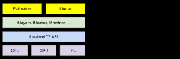

**Summary of hyperparameter tuning**

Most machine learning problems require a lot of hyperparameter tuning. Unfortunately, we can't provide concrete tuning rules for every model. Lowering the learning rate can help one model converge efficiently but make another model converge much too slowly. You must experiment to find the best set of hyperparameters for your dataset. That said, here are a few rules of thumb:

- Training loss should steadily decrease, steeply at first, and then more slowly until the slope of the curve reaches or approaches zero.
- If the training loss does not converge, train for more epochs.
- If the training loss decreases too slowly, increase the learning rate. Note that setting the learning rate too high may also prevent training loss from converging.
- If the training loss varies wildly (that is, the training loss jumps around), decrease the learning rate.
- Lowering the learning rate while increasing the number of epochs or the batch size is often a good combination.
- Setting the batch size to a very small batch number can also cause instability. First, try large batch size values. Then, decrease the batch size until you see degradation.
- For real-world datasets consisting of a very large number of examples, the entire dataset might not fit into memory. In such cases, you'll need to reduce the batch size to enable a batch to fit into memory.

Remember: the ideal combination of hyperparameters is data dependent, so you must always experiment and verify.

### Generalization

**Peril of Overfitting**

An overfit model gets a low loss during training but does a poor job predicting new data.

The fundamental tension of machine learning is between fitting our data well, but also fitting the data as simply as possible.

Machine learning's goal is to predict well on new data drawn from a (hidden) true probability distribution. Unfortunately, the model can't see the whole truth; the model can only sample from a training data set.

William of Ockham, a 14th century friar and philosopher, loved simplicity. He believed that scientists should prefer simpler formulas or theories over more complex ones. To put Ockham's razor in machine learning terms:
The less complex an ML model, the more likely that a good empirical result is not just due to the peculiarities of the sample.

In modern times, we've formalized Ockham's razor into the fields of statistical learning theory and computational learning theory. These fields have developed generalization bounds--a statistical description of a model's ability to generalize to new data based on factors such as:
- the complexity of the model
- the model's performance on training data

A machine learning model aims to make good predictions on new, previously unseen data. But if you are building a model from your data set, how would you get the previously unseen data? Well, one way is to divide your data set into two subsets:
- training set — a subset to train a model
- test set — a subset to test the model

Good performance on the test set is a useful indicator of good performance on the new data in general, assuming that:
- the test set is large enough
- you don't cheat by using the same test set over and over

The following three basic assumptions guide generalization:

- We draw examples independently and identically (i.i.d) at random from the distribution. In other words, examples don't influence each other. (An alternate explanation: i.i.d. is a way of referring to the randomness of variables.)
- The distribution is stationary; that is the distribution doesn't change within the data set
- We draw examples from partitions from the same distribution

### Training and Test Sets

**Splitting Data**

Make sure that your test set meets the following two conditions:

- is large enough to yield statistically meaningful results
- is representative of the data set as a whole. In other words, don't pick a test set with different characteristics than the training set.

Assuming that your test set meets the preceding two conditions, your goal is to create a model that generalizes well to new data. Our test set serves as a proxy for new data.

Never train on test data. If you are seeing surprisingly good results on your evaluation metrics, it might be a sign that you are accidentally training on the test set.

### Validation Set

Partitioning a data set into a training set and test set lets you judge whether a given model will generalize well to new data. However, using only two partitions may be insufficient when doing many rounds of hyperparameter tuning.

With two partitions, the workflow could look as follows:

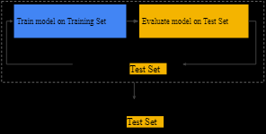

You can greatly reduce your chances of overfitting by partitioning the data set into the three subsets shown in the following figure:


Use the validation set to evaluate results from the training set. Then, use the test set to double-check your evaluation after the model has "passed" the validation set. The following figure shows this new workflow:

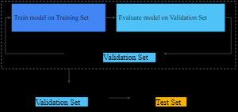

In this improved workflow:

1. Pick the model that does best on the validation set
2. Double-check that model against the test set

### Representation

A machine learning model can't directly see, hear, or sense input examples. Instead, you must create a representation of the data to provide the model with a useful vantage point into the data's key qualities. That is, in order to train a model, you must choose the set of features that best represent the data.

**Feature Engineering**

Feature engineering means transforming raw data into a feature vector.

Many machine learning models must represent the features as real-numbered vectors since the feature values must be multiplied by the model weights.

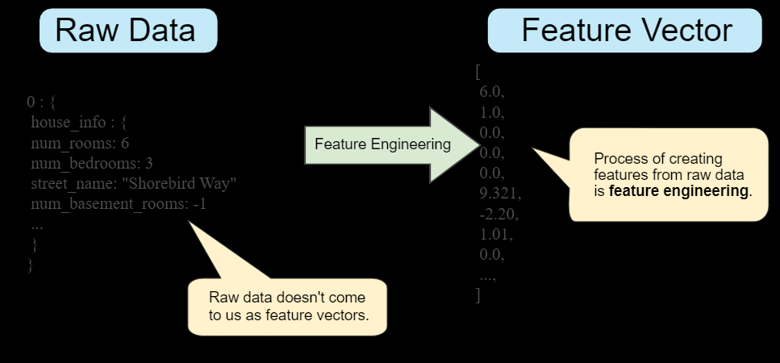

Mapping numeric values:
Integer and floating-point data don't need a special encoding because they can be multiplied by a numeric weight.

Mapping categorical values:
Categorical features have a discrete set of possible values. Since models cannot multiply strings by the learned weights, we use feature engineering to convert strings to numeric values.

We can accomplish this by defining a mapping from the feature values, which we'll refer to as the vocabulary of possible values, to integers.

To remove both these constraints, we can instead create a binary vector for each categorical feature in our model that represents values as follows:
- for values that apply to the example, set corresponding vector elements to 1
- Set all other elements to 0

The length of this vector is equal to the number of elements in the vocabulary. This representation is called a one-hot encoding when a single value is 1, and a multi-hot encoding when multiple values are 1.

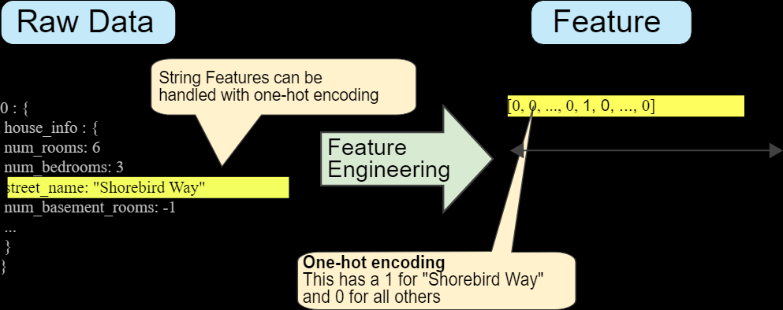

Sparse Representation:
only nonzero values are stored. In sparse representations, an independent model weight is still learned for each feature value, as described above.

**Qualities of Good Features**

- Avoid rarely used discrete feature values
- Prefer clear and obvious meanings
- Don't mix "magic" values with actual data

  In the original feature, replace the magic values as follows:
  - For variables that take a finite set of values (discrete variables), add a new value to the set and use it to signify that the feature value is missing
  - For continuous variables, ensure missing values do not affect the model by using the mean value of the feature's data

- Account for upstream instability

The definition of a feature shouldn't change over time.

**Cleaning Data**

_Scaling feature values_

Scaling means converting floating-point feature values from their natural range (for example, 100 to 900) into a standard range (for example, 0 to 1 or -1 to +1). If a feature set consists of only a single feature, then scaling provides little to no practical benefit. If, however, a feature set consists of multiple features, then feature scaling provides the following benefits:

- Helps gradient descent converge more quickly
- Helps avoid the "NaN trap," in which one number in the model becomes a NaN, and—due to math operations—every other number in the model also eventually becomes a NaN
- Helps the model learn appropriate weights for each feature. Without feature scaling, the model will pay too much attention to the features having a wider range

You don't have to give every floating-point feature exactly the same scale.

_Handling extreme outliers_

How could we minimize the influence of those extreme outliers? Well, one way would be to take the log of every value.

Log scaling does a slightly better job, but there's still a significant tail of outlier values. Let's pick yet another approach. What if we simply "cap" or "clip" the maximum value?

_Binning_

x

_Scrubbing_

Until now, we've assumed that all the data used for training and testing was trustworthy. In real-life, many examples in data sets are unreliable due to one or more of the following:
- omitted values. For instance, a person forgot to enter a value for a house's age
- duplicate examples. For example, a server mistakenly uploaded the same logs twice
- bad labels. For instance, a person mislabeled a picture of an oak tree as a maple
- bad feature values. For example, someone typed in an extra digit, or a thermometer was left out in the sun.

Once detected, you typically "fix" bad examples by removing them from the data set. To detect omitted values or duplicated examples, you can write a simple program. Detecting bad feature values or labels can be far trickier.

In addition to detecting bad individual examples, you must also detect bad data in the aggregate. Histograms are a great mechanism for visualizing your data in the aggregate. In addition, getting statistics like the following can help:
- Maximum and minimum
- Mean and median
- Standard deviation

_Know your data_

Follow these rules:
- keep in mind what you think your data should look like
- verify that the data meets these expectations (or that you can explain why it doesn’t)
- double-check that the training data agrees with other sources (for example, dashboards)

### Feature Crosses

A feature cross is a synthetic feature formed by multiplying (crossing) two or more features. Crossing combinations of features can provide predictive abilities beyond what those features can provide individually.

**Encoding Nonlinearity**

A feature cross is a synthetic feature that encodes nonlinearity in the feature space by multiplying two or more input features together. (The term cross comes from cross product.) Let's create a feature cross named x_3 by crossing x_1 and x_2: x_3 = x_1 x_2

We treat this newly minted x_3 feature cross just like any other feature. The linear formula becomes: y = b + w_1 x_1 + w_2 x_2 + w_3 x_3

A linear algorithm can learn a weight for w_3 just as it would for w_1 and w_2. In other words, although  encodes nonlinear information, you don’t need to change how the linear model trains to determine the value of w_3.

Kinds of feature crosses

We can create many different kinds of feature crosses. For example:
- [A X B]: a feature cross formed by multiplying the values of two features
- [A x B x C x D x E]: a feature cross formed by multiplying the values of five features
- [A x A]: a feature cross formed by squaring a single feature.

**Crossing One-Hot Vectors**

Machine learning models do frequently cross one-hot feature vectors. Think of feature crosses of one-hot feature vectors as logical conjunctions.

### Regularization: Simplicity

Regularization means penalizing the complexity of a model to reduce overfitting.

**L₂ Regularization**

In other words, instead of simply aiming to minimize loss (empirical risk minimization):

minimize(Loss(Data|Model))

we'll now minimize loss+complexity, which is called structural risk minimization:

minimize(Loss(Data|Model) + complexity(Model))

Our training optimization algorithm is now a function of two terms: the loss term, which measures how well the model fits the data, and the regularization term, which measures model complexity.

If model complexity is a function of weights, a feature weight with a high absolute value is more complex than a feature weight with a low absolute value.

We can quantify complexity using the L2 regularization formula, which defines the regularization term as the sum of the squares of all the feature weights.

In this formula, weights close to zero have little effect on model complexity, while outlier weights can have a huge impact.

**Lambda**

Model developers tune the overall impact of the regularization term by multiplying its value by a scalar known as lambda (also called the regularization rate). That is, model developers aim to do the following:

minimize(Loss(Data|Model) + $\lambda$complexity(Model))

Performing L2 regularization has the following effect on a model:
- encourages weight values toward 0 (but not exactly 0
- encourages the mean of the weights toward 0, with a normal (bell-shaped or Gaussian) distribution

Increasing the lambda value strengthens the regularization effect.

When choosing a lambda value, the goal is to strike the right balance between simplicity and training-data fit:
- if your lambda value is too high, your model will be simple, but you run the risk of underfitting your data. Your model won't learn enough about the training data to make useful predictions
- if your lambda value is too low, your model will be more complex, and you run the risk of overfitting your data. Your model will learn too much about the particularities of the training data, and won't be able to generalize to new data

### Logistic Regression

Instead of predicting exactly 0 or 1, logistic regression generates a probability—a value between 0 and 1, exclusive.

**Calculating a Probability**

Many problems require a probability estimate as output. Logistic regression is an extremely efficient mechanism for calculating probabilities. Practically speaking, you can use the returned probability in either of the following two ways:
- "As is"
- converted to a binary category

**Loss and Regularization**

The loss function for linear regression is squared loss. The loss function for logistic regression is Log Loss, which is defined as follows:

Log Loss = $\sum - y log(y') - (1-y) log(1-y')$

where: 
- (x,y) $\in$ D is the data set containing many labeled examples, which are  pairs
- y is the label in a labeled example. Since this is logistic regression, every value of y must either be 0 or 1
- y' is the predicted value (somewhere between 0 and 1), given the set of features in x.

Regularization is extremely important in logistic regression modeling. Without regularization, the asymptotic nature of logistic regression would keep driving loss towards 0 in high dimensions. Consequently, most logistic regression models use one of the following two strategies to dampen model complexity:
- L2 regularization
- Early stopping, that is, limiting the number of training steps or the learning rate

### Classification

**Thresholding**

In order to map a logistic regression value to a binary category, you must define a classification threshold (also called the decision threshold).

**True vs. False and Positive vs. Negative**

A true positive is an outcome where the model correctly predicts the positive class. Similarly, a true negative is an outcome where the model correctly predicts the negative class.

A false positive is an outcome where the model incorrectly predicts the positive class. And a false negative is an outcome where the model incorrectly predicts the negative class.

**Accuracy**

Accuracy is one metric for evaluating classification models. Informally, accuracy is the fraction of predictions our model got right. Formally, accuracy has the following definition:

Accuracy = number of correct predictions / total number of predictions

For binary classification, accuracy can also be calculated in terms of positives and negatives as follows:

Accuracy = (TP + TN)/(TP + TN + FP + FN)

Accuracy alone doesn't tell the full story when you're working with a class-imbalanced data set, where there is a significant disparity between the number of positive and negative labels.

**Precision and Recall**

Precision is defined as follows:

Precision = TP / (TP + FP)

Mathematically, recall is defined as follows:

Recall = TP / (TP + FN)

To fully evaluate the effectiveness of a model, you must examine both precision and recall. Unfortunately, precision and recall are often in tension. That is, improving precision typically reduces recall and vice versa.

**ROC Curve and AUC**

ROC curve: an ROC curve (receiver operating characteristic curve) is a graph showing the performance of a classification model at all classification thresholds. 

This curve plots two parameters:
- True Positive Rate
- False Positive Rate

True Positive Rate (TPR) is a synonym for recall and is therefore defined as follows:

TPR = TP / (TP + FN)

False Positive Rate (FPR) is defined as follows:

FPR = FP / (FP + TN)

An ROC curve plots TPR vs. FPR at different classification thresholds. Lowering the classification threshold classifies more items as positive, thus increasing both False Positives and True Positives. The following figure shows a typical ROC curve.

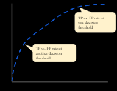

To compute the points in an ROC curve, there's an efficient, sorting-based algorithm that can provide this information for us, called AUC.

AUC stands for "Area under the ROC Curve." That is, AUC measures the entire two-dimensional area underneath the entire ROC curve (think integral calculus) from (0,0) to (1,1).

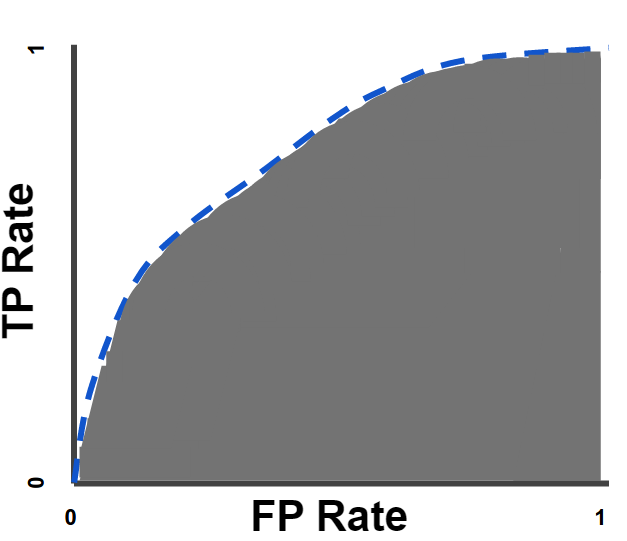

AUC provides an aggregate measure of performance across all possible classification thresholds. One way of interpreting AUC is as the probability that the model ranks a random positive example more highly than a random negative example.

AUC ranges in value from 0 to 1. A model whose predictions are 100% wrong has an AUC of 0.0; one whose predictions are 100% correct has an AUC of 1.0.

AUC is desirable for the following two reasons:

- AUC is scale-invariant. It measures how well predictions are ranked, rather than their absolute values.
- AUC is classification-threshold-invariant. It measures the quality of the model's predictions irrespective of what classification threshold is chosen.

However, both these reasons come with caveats, which may limit the usefulness of AUC in certain use cases:

- Scale invariance is not always desirable. For example, sometimes we really do need well calibrated probability outputs, and AUC won’t tell us about that
- Classification-threshold invariance is not always desirable. In cases where there are wide disparities in the cost of false negatives vs. false positives, it may be critical to minimize one type of classification error.

**Prediction Bias**

Logistic regression predictions should be unbiased. That is: "average of predictions" should ≈ "average of observations"

Prediction bias is a quantity that measures how far apart those two averages are. That is: 

prediction bias = average of predictions - average of labels in data set

A significant nonzero prediction bias tells you there is a bug somewhere in your model, as it indicates that the model is wrong about how frequently positive labels occur.

Possible root causes of prediction bias are:
- Incomplete feature set
- Noisy data set
- Buggy pipeline
- Biased training sample
- Overly strong regularization

You might be tempted to correct prediction bias by post-processing the learned model—that is, by adding a calibration layer that adjusts your model's output to reduce the prediction bias.

However, adding a calibration layer is a bad idea for the following reasons:

- You're fixing the symptom rather than the cause.
- You've built a more brittle system that you must now keep up to date.

If possible, avoid calibration layers. Projects that use calibration layers tend to become reliant on them—using calibration layers to fix all their model's sins. Ultimately, maintaining the calibration layers can become a nightmare.

Bucketing and Prediction Bias

You can form buckets in the following ways:
- Linearly breaking up the target predictions
- Forming quantiles

### Regularization for Sparsity

**L₁ Regularization**

Sparse vectors often contain many dimensions. Creating a feature cross results in even more dimensions. Given such high-dimensional feature vectors, model size may become huge and require huge amounts of RAM.

In a high-dimensional sparse vector, it would be nice to encourage weights to drop to exactly 0 where possible. A weight of exactly 0 essentially removes the corresponding feature from the model. Zeroing out features will save RAM and may reduce noise in the model.

We might be able to encode this idea into the optimization problem done at training time, by adding an appropriately chosen regularization term.

Would L2 regularization accomplish this task? Unfortunately not. L2 regularization encourages weights to be small, but doesn't force them to exactly 0.0.

An alternative idea would be to try and create a regularization term that penalizes the count of non-zero coefficient values in a model. Increasing this count would only be justified if there was a sufficient gain in the model's ability to fit the data. Unfortunately, while this count-based approach is intuitively appealing, it would turn our convex optimization problem into a non-convex optimization problem. So this idea, known as L0 regularization isn't something we can use effectively in practice.

However, there is a regularization term called L1 regularization that serves as an approximation to L0, but has the advantage of being convex and thus efficient to compute. So we can use L1 regularization to encourage many of the uninformative coefficients in our model to be exactly 0, and thus reap RAM savings at inference time.

L2 and L1 penalize weights differently:
- L2 penalizes weight^2
- L1 penalizes |weight|

Consequently, L2 and L1 have different derivatives:
- The derivative of L2 is 2 * weight
- The derivative of L1 is k (a constant, whose value is independent of weight)

You can think of the derivative of L2 as a force that removes x% of the weight every time.

You can think of the derivative of L1 as a force that subtracts some constant from the weight every time. However, thanks to absolute values, L1 has a discontinuity at 0, which causes subtraction results that cross 0 to become zeroed out.

### Neural Networks

Neural networks are a more sophisticated version of feature crosses. In essence, neural networks learn the appropriate feature crosses for you.

**Structure**

To see how neural networks might help with nonlinear problems, let's start by representing a linear model as a graph:

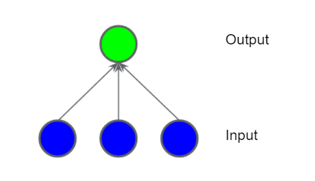

Each blue circle represents an input feature, and the green circle represents the weighted sum of the inputs.

In the model represented by the following graph, we've added a "hidden layer" of intermediary values. Each yellow node in the hidden layer is a weighted sum of the blue input node values. The output is a weighted sum of the yellow nodes.

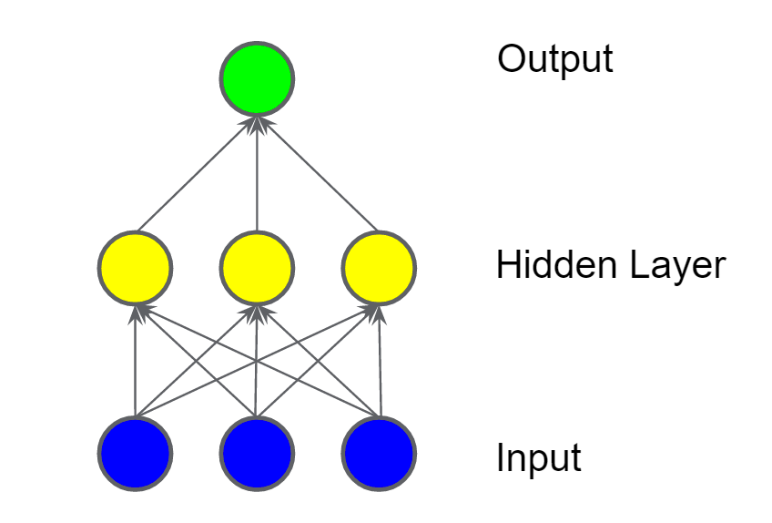

In the model represented by the following graph, we've added a second hidden layer of weighted sums.

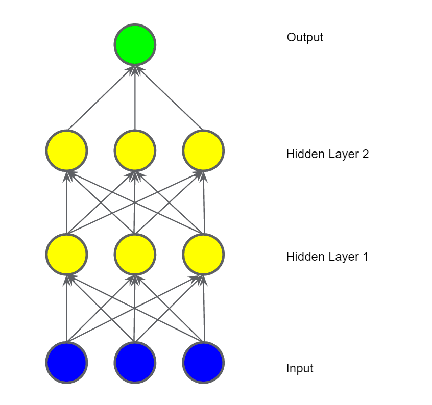

Activation Functions

To model a nonlinear problem, we can directly introduce a nonlinearity. We can pipe each hidden layer node through a nonlinear function.

In the model represented by the following graph, the value of each node in Hidden Layer 1 is transformed by a nonlinear function before being passed on to the weighted sums of the next layer. This nonlinear function is called the activation function.

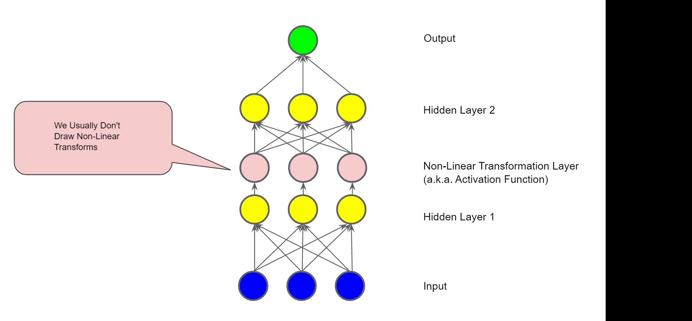

In brief, each layer is effectively learning a more complex, higher-level function over the raw inputs.

_Common Activation Functions_

The following sigmoid activation function converts the weighted sum to a value between 0 and 1.

$F(x) = \frac{1}{1 + e^{-x}}$

The following rectified linear unit activation function (or ReLU, for short) often works a little better than a smooth function like the sigmoid, while also being significantly easier to compute.

$F(x) = max(0,x)$

The superiority of ReLU is based on empirical findings, probably driven by ReLU having a more useful range of responsiveness. A sigmoid's responsiveness falls off relatively quickly on both sides.

In fact, any mathematical function can serve as an activation function.

_Summary_

Now our model has all the standard components of what people usually mean when they say "neural network":

- A set of nodes, analogous to neurons, organized in layers
- A set of weights representing the connections between each neural network layer and the layer beneath it. The layer beneath may be another neural network layer, or some other kind of layer
- A set of biases, one for each node
- An activation function that transforms the output of each node in a layer. Different layers may have different activation functions

### Training Neural Networks

Backpropagation is the most common training algorithm for neural networks. It makes gradient descent feasible for multi-layer neural networks.

**Best Practices**

_Failure Cases_

There are a number of common ways for backpropagation to go wrong.

Vanishing Gradients

The gradients for the lower layers (closer to the input) can become very small. In deep networks, computing these gradients can involve taking the product of many small terms.

When the gradients vanish toward 0 for the lower layers, these layers train very slowly, or not at all.

The ReLU activation function can help prevent vanishing gradients.

Exploding Gradients

If the weights in a network are very large, then the gradients for the lower layers involve products of many large terms. In this case you can have exploding gradients: gradients that get too large to converge.

Batch normalization can help prevent exploding gradients, as can lowering the learning rate.

Dead ReLU Units

Once the weighted sum for a ReLU unit falls below 0, the ReLU unit can get stuck. It outputs 0 activation, contributing nothing to the network's output, and gradients can no longer flow through it during backpropagation. With a source of gradients cut off, the input to the ReLU may not ever change enough to bring the weighted sum back above 0.

Lowering the learning rate can help keep ReLU units from dying.

Dropout Regularization

Yet another form of regularization, called Dropout, is useful for neural networks. It works by randomly "dropping out" unit activations in a network for a single gradient step. The more you drop out, the stronger the regularization:

- 0.0 = No dropout regularization
- 1.0 = Drop out everything. The model learns nothing
- Values between 0.0 and 1.0 = More useful

### Multi-Class Neural Networks

**One vs. All**

One vs. all provides a way to leverage binary classification. Given a classification problem with N possible solutions, a one-vs.-all solution consists of N separate binary classifiers—one binary classifier for each possible outcome. During training, the model runs through a sequence of binary classifiers, training each to answer a separate classification question.

This approach is fairly reasonable when the total number of classes is small, but becomes increasingly inefficient as the number of classes rises.

We can create a significantly more efficient one-vs.-all model with a deep neural network in which each output node represents a different class. The following figure suggests this approach:

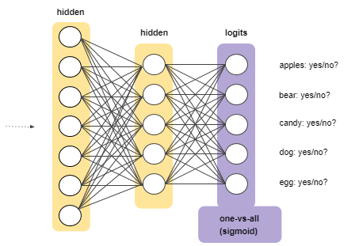

**Softmax**

Softmax extends this idea into a multi-class world. That is, Softmax assigns decimal probabilities to each class in a multi-class problem. Those decimal probabilities must add up to 1.0. This additional constraint helps training converge more quickly than it otherwise would.

Softmax is implemented through a neural network layer just before the output layer. The Softmax layer must have the same number of nodes as the output layer.

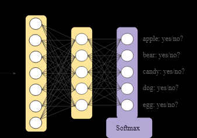

Softmax Options

Consider the following variants of Softmax:
- Full Softmax is the Softmax we've been discussing; that is, Softmax calculates a probability for every possible class
- Candidate sampling means that Softmax calculates a probability for all the positive labels but only for a random sample of negative labels. For example, if we are interested in determining whether an input image is a beagle or a bloodhound, we don't have to provide probabilities for every non-doggy example

Full Softmax is fairly cheap when the number of classes is small but becomes prohibitively expensive when the number of classes climbs. Candidate sampling can improve efficiency in problems having a large number of classes.

One Label vs. Many Labels

Softmax assumes that each example is a member of exactly one class. Some examples, however, can simultaneously be a member of multiple classes. For such examples:
- You may not use Softmax
- You must rely on multiple logistic regressions

### Embeddings

An embedding is a relatively low-dimensional space into which you can translate high-dimensional vectors. Embeddings make it easier to do machine learning on large inputs like sparse vectors representing words. Ideally, an embedding captures some of the semantics of the input by placing semantically similar inputs close together in the embedding space. An embedding can be learned and reused across models.

**Motivation From Collaborative Filtering**

Collaborative filtering is the task of making predictions about the interests of a user based on interests of many other users.

**Categorical Input Data**

Categorical data refers to input features that represent one or more discrete items from a finite set of choices.

Categorical data is most efficiently represented via sparse tensors, which are tensors with very few non-zero elements.

_Size of Network_

Huge input vectors mean a super-huge number of weights for a neural network. If there are M words in your vocabulary and N nodes in the first layer of the network above the input, you have MxN weights to train for that layer. A large number of weights causes further problems:

- Amount of data. The more weights in your model, the more data you need to train effectively
- Amount of computation. The more weights, the more computation required to train and use the model. It's easy to exceed the capabilities of your hardware

**Translating to a Lower-Dimensional Space**

You can solve the core problems of sparse input data by mapping your high-dimensional data into a lower-dimensional space.

Shrinking the network

While we want enough dimensions to encode rich semantic relations, we also want an embedding space that is small enough to allow us to train our system more quickly. A useful embedding may be on the order of hundreds of dimensions. This is likely several orders of magnitude smaller than the size of your vocabulary for a natural language task.

Embeddings as lookup tables

An embedding is a matrix in which each column is the vector that corresponds to an item in your vocabulary. To get the dense vector for a single vocabulary item, you retrieve the column corresponding to that item.

Embedding lookup as matrix multiplication

The lookup, multiplication, and addition procedure we've just described is equivalent to matrix multiplication. Given a 1 x n sparse representation S and an n x m embedding table E, the matrix product SE gives you a 1 x m dense vector.

**Obtaining Embeddings**

Standard Dimensionality Reduction Techniques

There are many existing mathematical techniques for capturing the important structure of a high-dimensional space in a low dimensional space. In theory, any of these techniques could be used to create an embedding for a machine learning system.

For example, principal component analysis (PCA) has been used to create word embeddings. Given a set of instances like bag of words vectors, PCA tries to find highly correlated dimensions that can be collapsed into a single dimension.

Word2vec

Word2vec is an algorithm invented at Google for training word embeddings. Word2vec relies on the distributional hypothesis to map semantically similar words to geometrically close embedding vectors.

Training an Embedding as Part of a Larger Model

You can also learn an embedding as part of the neural network for your target task. This approach gets you an embedding well customized for your particular system, but may take longer than training the embedding separately.

In general, when you have sparse data (or dense data that you'd like to embed), you can create an embedding unit that is just a special type of hidden unit of size d. This embedding layer can be combined with any other features and hidden layers. As in any DNN, the final layer will be the loss that is being optimized. For example, let's say we're performing collaborative filtering, where the goal is to predict a user's interests from the interests of other users. We can model this as a supervised learning problem by randomly setting aside (or holding out) a small number of the movies that the user has watched as the positive labels, and then optimize a softmax loss.